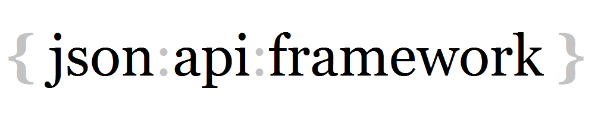

# JsonApiFramework

> **JsonApiFramework** is a fast, extensible, and portable **C#/.NET framework** for the reading and writing of client-side and server-side [JSON API](http://jsonapi.org) documents based on the domain model of the hypermedia API resources.



## Overview

[JSON API](http://jsonapi.org) is an excellent specification for building hypermedia ([Level 3 REST API](http://martinfowler.com/articles/richardsonMaturityModel.html)) APIs in JSON. Using this standard solves the problem of how to **format** your hypermedia API responses (server) as well as requests for creating, updating, and deleting resources (client) with JSON. Adopting this standard promotes standardized communication protocols between client applications and hypermedia API servers making development and consumption of the hypermedia API effortless.

**JsonApiFramework** is a fast, extensible, and portable **C#/.NET framework** that implements the [JSON API](http://jsonapi.org) 1.0 version of the specification that enables .NET developers to work with JSON API documents at a high level using .NET objects. Therefore the JsonApiFramework helps .NET developers focus on core application functionality rather than on protocol implementation.

### Benefits and Features

- **Never** have to work with JSON directly, instead work with C# objects
- Reading JSON API documents through a *C# reader interface*
- Building and Writing JSON API documents through a **C# fluent-style progressive builder interface** for
    - *Resource* object documents
    - *Resource Identifier* object documents
    - *Error* object documents
- Automatic generation of JSON API standard **hypermedia** for
    - Document links
    - Resource relationships and links	
- Automatic conversion between JSON API resources and .NET CLR resources
- Support for both **client-side** and **server-side** specific JSON API document building
- Support for JSON API **compound documents** by
    - Inclusion of related resources
    - Circular resource references supported
    - Automatic generation of resource linkage between related resources 
- Support for **HATEOAS** (Hypermedia as the Engine of Application State) for resource relationship and links 
- Support for **complex types** at the resource level
- Support for meta information at the document, resource, relationship, link, error, and JSON API object levels
- Support for JSON API protocol version information at the document JSON API object level
- Support for cross-platform development via PCL (**P**ortable **C**lass **L**ibrary) with `Profile 78`
    - .NET Framework 4.5
    - Windows Phone 8
    - .NET for Windows Store apps
    - Xamarin.Android
    - Xamarin.iOS
    - Xamarin.iOS (Classic)
- Fast reading and writing of JSON API documents
    - Internally uses a specialized DOM (**D**ocument **O**bject **M**odel) tree representing the JSON API document in memory
    - Internally uses little reflection (slow), instead favoring compiled .NET expressions for **fast conversion** between JSON API and .NET CLR resources

Extreme high code quality with **1,900+ unit tests**. Production ready.

**For further details, please check out the [wiki](https://github.com/scott-mcdonald/JsonApiFramework/wiki) and [samples](https://github.com/scott-mcdonald/JsonApiFramework.Samples)**

## Usage examples

The following are some brief but concise usage examples to get an overall feel for how JsonApiFramework works both client-side and server-side of things. More usage examples will be found in the [wiki](https://github.com/scott-mcdonald/JsonApiFramework/wiki) and [samples](https://github.com/scott-mcdonald/JsonApiFramework.Samples).

Assume the following for the usage examples:

``` cs
JsonApiFramework CLR Types
--------------------------
Document                    Represents a JSON API document.
DocumentContext             Represents a session with a JSON API document.
IResource                   Abstracts the concept of a CLR resource. This is a marker interface
                            and has no methods.

                            Rationale for requiring this interface is to "mark" resource classes
                            for compile-time generic constraint purposes.

                            This aids in compile-time checks and generic inferences in the
                            progressive fluent style builder interfaces/classes of the framework.

Blogging CLR Types
------------------
BloggingDocumentContext     Specialization of DocumentContext for blogging resource types.

                            Internally contains the service model (think metadata) of the
                            blogging resource types with optional naming conventions to apply
                            when converting between JSON API and .NET CLR resources.     

public class Blog : IResource
{
    public long BlogId { get; set; }
    public string Name { get; set; }
}

public class Article : IResource
{
    public long ArticleId { get; set; }
    public string Title { get; set; }
    public string Text { get; set; }
}

public class Comment : IResource
{
    public long CommentId { get; set; }
    public string Body { get; set; }
}

public class Person : IResource
{
    public long PersonId { get; set; }
    public string FirstName { get; set; }
    public string LastName { get; set; }
    public string Twitter { get; set; }
}

Relationships
-------------
Blog has "to-many" relationship to Article named "articles"

Article has "to-one" relationship to Person named "author"
Article has "to-many" relationship to Comment named "comments"

Comment has "to-one" relationship to Person named "author"
```

### Server-side document building example #1:

This example shows how a server-side Web API Controller could construct and return a JSON API document for the following `GET` request for an individual article:

``` http
GET http://example.com/articles/1
```

``` cs
public class ArticlesController : ApiController
{
    [Route("articles/{id}")]
    public async Task<IHttpActionResult> GetAsync(string id)
    {
        Contract.Requires(String.IsNullOrWhitespace(id) == false);

        // Get article /////////////////////////////////////////////////////
        var article = await GetArticle(id);

        // Build and return JSON API document ////////////////////////////// 
        var currentRequestUrl = HttpContext.Current.Request.Url;
        using (var documentContext = new BloggingDocumentContext())
        {
            // Build new document.
            var document = documentContext
                .NewDocument(currentRequestUrl)

                    // Document links
                    .Links()
                        .AddUpLink()
                        .AddSelfLink()
                    .LinksEnd()

                    // Resource document (convert CLR Article resource to JSON API resource)
                    .Resource(article)
                        // Article relationships
                        .Relationships()
                            .Relationship("author") // article -> author
                                .Links()
                                    .AddSelfLink()
                                    .AddRelatedLink()
                                .LinksEnd()
                            .RelationshipEnd()

                            .Relationship("comments") // article -> comments
                                .Links()
                                    .AddSelfLink()
                                    .AddRelatedLink()
                                .LinksEnd()
                            .RelationshipEnd()
                        .RelationshipsEnd()

                        // Article links
                        .Links()
                            .AddSelfLink()
                        .LinksEnd()
                    .ResourceEnd()

                .WriteDocument();
    
            // Return 200 OK
            // Note: WebApi JsonMediaTypeFormatter serializes the JSON API document into JSON. 
            return this.Ok(document);
        }
    }
}
```

will create the following example JSON

``` json
{
  "links": {
    "up": "http://example.com/articles",
    "self": "http://example.com/articles/1"
  },
  "data": {
    "type": "articles",
    "id": "1",
    "attributes": {
      "title": "JSON API paints my bikeshed!",
      "text": "If you’ve ever argued with your team about the way your JSON responses should be
               formatted, JSON API can be your anti-bikeshedding tool."
    },
    "relationships": {
      "author": {
        "links": {
          "self": "http://example.com/articles/1/relationships/author",
          "related": "http://example.com/articles/1/author"
        }
      },
      "comments": {
        "links": {
          "self": "http://example.com/articles/1/relationships/comments",
          "related": "http://example.com/articles/1/comments"
        }
      }
    },
    "links": {
      "self": "http://example.com/articles/1"
    }
  }
}
```

### Server-side document building example #2:

This example shows how a server-side Web API Controller could construct and return a JSON API document for the following `GET` request for an individual article and server-side include of the article's related author and comments:

``` http
GET http://example.com/articles/1
```

``` cs
public class ArticlesController : ApiController
{
    [Route("articles/{id}")]
    public async Task<IHttpActionResult> GetAsync(string id)
    {
        Contract.Requires(String.IsNullOrWhitespace(id) == false);

        // Get article and related author and comments /////////////////////
        var article = await GetArticle();
        var author = await GetArticleAuthor(article);
        var comments = await GetArticleComments(article);

        // Build and return JSON API document ////////////////////////////// 
        var currentRequestUrl = HttpContext.Current.Request.Url;
        using (var documentContext = new BloggingDocumentContext())
        {
            // Build new document.
            var document = documentContext
                .NewDocument(currentRequestUrl)

                    // Document links
                    .Links()
                        .AddLink("up")
                        .AddLink("self")
                    .LinksEnd()

                    // Resource document (convert CLR Article resource to JSON API resource)
                    .Resource(article)
                        // Article relationships
                        .Relationships()
                            .AddRelationship("author", "self", "related")   // article -> author
                            .AddRelationship("comments", "self", "related") // article -> comments
                        .RelationshipsEnd()

                        // Article links
                        .Links()
                            .AddLink("self")
                        .LinksEnd()
                    .ResourceEnd()

                    // With included resources
                    .Included()

                        // Convert related "to-one" CLR Person resource to JSON API resource
                        // Automatically generate "to-one" resource linkage in article to related author
                        .ToOne(article, "author", author)
                            // Author(Person) relationships
                            .Relationships()
                                .AddRelationship("comments", "self", "related") // author -> comments
                            .RelationshipsEnd()

                            // Author(Person) links
                            .Links()
                                .AddLink("self")
                            .LinksEnd()
                        .ToOneEnd()

                        // Convert related "to-many" CLR Comment resources to JSON API resources
                        // Automatically generate "to-many" resource linkage in article to related comments
                        .ToMany(article, "comments", comments)
                            // Comments relationships
                            .Relationships()
                                .AddRelationship("author", "self", "related") // comments -> author
                            .RelationshipsEnd()

                            // Comments links
                            .Links()
                                .AddLink("self")
                            .LinksEnd()
                        .ToManyEnd()

                    .IncludedEnd()

                .WriteDocument();
    
            // Return 200 OK
            // Note: WebApi JsonMediaTypeFormatter serializes the JSON API document into JSON. 
            return this.Ok(document);
        }
    }
}
```

will create the following example JSON

``` json
{
  "links": {
    "up": "http://example.com/articles",
    "self": "http://example.com/articles/1"
  },
  "data": {
      "type": "articles",
      "id": "1",
      "attributes": {
        "title": "JSON API paints my bikeshed!",
        "text": "If you’ve ever argued with your team about the way your JSON responses should be
                 formatted, JSON API can be your anti-bikeshedding tool."
      },
      "relationships": {
        "author": {
          "links": {
            "self": "http://example.com/articles/1/relationships/author",
            "related": "http://example.com/articles/1/author"
          },
          "data": { "type": "people", "id": "9" }
        },
        "comments": {
          "links": {
            "self": "http://example.com/articles/1/relationships/comments",
            "related": "http://example.com/articles/1/comments"
          },
          "data": [
            { "type": "comments", "id": "5" },
            { "type": "comments", "id": "12" }
          ]
        }
      },
      "links": {
        "self": "http://example.com/articles/1"
      }
    },
  "included": [
    {
      "type": "people",
      "id": "9",
      "attributes": {
        "first-name": "Dan",
        "last-name": "Gebhardt",
        "twitter": "dgeb"
      },
      "relationships": {
        "comments": {
          "links": {
            "self": "http://example.com/people/9/relationships/comments",
            "related": "http://example.com/people/9/comments"
          }
        }
      },
      "links": {
        "self": "http://example.com/people/9"
      }
    },
    {
      "type": "comments",
      "id": "5",
      "attributes": {
        "body": "First!"
      },
      "relationships": {
        "author": {
          "links": {
            "self": "http://example.com/comments/5/relationships/author",
            "related": "http://example.com/comments/5/author"
          }
        }
      },
      "links": {
        "self": "http://example.com/comments/5"
      }
    },
    {
      "type": "comments",
      "id": "12",
      "attributes": {
        "body": "I like XML better"
      },
      "relationships": {
        "author": {
          "links": {
            "self": "http://example.com/comments/12/relationships/author",
            "related": "http://example.com/comments/12/author"
          }
        }
      },
      "links": {
        "self": "http://example.com/comments/12"
      }
    }
  ]
}
```

### Client-side document building for POST example:

This example shows how a client-side ViewModel could construct and send a `POST` request with a JSON API document for creating resource purposes:

``` http
POST http://example.com/articles
```

``` cs
public class ArticlesViewModel : ViewModel
{
    public async Task<bool> CreateNewArticleAsync(string title, string text, long authorId)
    {
        // Create new article for respective author.
        var article = new Article { Title = title, Text = text };

        // Build and POST JSON API document to create new article. 
        using (var documentContext = new BloggingDocumentContext())
        {
            // Build document
            var document = documentContext
                .NewDocument()
                    // Resource document (convert CLR Article resource to JSON API resource)
                    .Resource(article)
                        // Link new article to an existing author.
                        .Relationships()
                            .AddRelationship("author", authorId)
                        .RelationshipsEnd()
                    .ResourceEnd()
                .WriteDocument();

            // POST document
            var documentJson = document.ToJson();
            var content = new StringContent(documentJson, Encoding.UTF8, "application/json")

            var httpClient = new HttpClient();
            httpClient.DefaultRequestHeaders
                      .Accept
                      .Add(new MediaTypeWithQualityHeaderValue("application/json"));
            var response = await httpClient.PostAsync("http://example.com/articles", content);

            response.EnsureSuccessStatusCode();
            return true;
        }
    }
}
```

will create the following example JSON

``` json
{
  "data": {
    "type": "articles",
    "attributes": {
      "title": "JSON API paints my house!",
      "text": "If you’ve ever argued with your team about the way your JSON responses should be
               formatted, JSON API can be your anti-bikeshedding tool."
    },
    "relationships": {
      "author": {
        "data": { "type": "people", "id": "9" }
      }
    }
  }
}
```

### Client-side document building for PATCH example:

This example shows how a client-side ViewModel could construct and send a `PATCH` request with a JSON API document for updating resource purposes:

``` http
PATCH http://example.com/articles/2
```

``` cs
public class ArticlesViewModel : ViewModel
{
    public async Task<bool> UpdateExistingArticleTitleAsync(long articleId, string newTitle)
    {
        // Build and PATCH JSON API document to update an existing article's title. 
        using (var documentContext = new BloggingDocumentContext())
        {
            // Build document.
            var document = documentContext
                .NewDocument()
                    // Resource document (manually build an Article JSON API resource)
                    .Resource<Article>()
                        // Set primary key
                        .SetId(articleId)

                        // Update title attribute
                        .Attributes()
                            .AddAttribute(article => article.Title, newTitle)
                        .AttributesEnd()
                    .ResourceEnd()
                .WriteDocument();
            var documentJson = document.ToJson();

            // PATCH document.
            var content = new StringContent(documentJson, Encoding.UTF8, "application/json")

            var httpClient = new HttpClient();
            httpClient.DefaultRequestHeaders
                      .Accept
                      .Add(new MediaTypeWithQualityHeaderValue("application/json"));
            var response = await httpClient.PatchAsync("http://example.com/articles/2", content);

            response.EnsureSuccessStatusCode();
            return true;
        }
    }
}
```

will create the following example JSON

``` json
{
  "data": {
    "type": "articles",
    "id": "2",
    "attributes": {
      "title": "To TDD or Not"
    }
  }
}
```

### Document reading example:

> Document reading is the same for either client-side or server-side.

This example shows how a client application or server hypermedia API server could receive and read a JSON API resource document for an individual article with included author and comments:

``` cs
public class ArticleReader
{
    public void ReadJsonApiDocument(string json)
    {
        // Parse and read JSON API document. 
        var document = JsonObject.Parse<Document>(json);
        using (var documentContext = new BloggingDocumentContext(document))
        {
            // Read JSON API protocol version //////////////////////////////////
            var jsonApiVersion = documentContext.GetJsonApiVersion();

            // Read Document-Level things //////////////////////////////////////
            var documentType = documentContext.GetDocumentType();
            Assume(documenType == DocumentType.ResourceDocument);

            var documentMeta = documentContext.GetDocumentMeta();
            var documentLinks = documentContext.GetDocumentLinks();

            Assume(documentLinks.ContainsLink("self") == true);
            var documentSelfLink = documentLinks ["self"]; 

            // Read Resource-Level things //////////////////////////////////////

            // Articles
            var article = documentContext.GetResource<Article>();
            var articleLinks = documentContext.GetResourceLinks(article);
            var articleSelfLink = articleLinks ["self"]; 

            var articleRelationships = documentContext.GetResourceRelationships(article);
            Assume(articleRelationships.ContainsRelationship("author") == true);
            Assume(articleRelationships.ContainsRelationship("comments") == true);

            // Related Author
            var authorRelationship = articleRelationships ["author"];
            var authorRelationshipLinks = authorRelationship.Links;
            var authorRelationshipSelfLink = authorRelationshipLinks ["self"];
            var authorRelationshipRelatedLink = authorRelationshipLinks ["related"];
            var authorRelationshipMeta = authorRelationship.Meta

            Assume(authorRelationship.IsResourceLinkageNullOrEmpty() == false);

            var author = documentContext.GetRelatedResource<Person>(authorRelationship);
            
            // Related Comments
            var commentsRelationship = articleRelationships ["comments"];
            var commentsRelationshipLinks = commentsRelationship.Links;
            var commentsRelationshipSelfLink = commentsRelationshipLinks ["self"];
            var commentsRelationshipRelatedLink = commentsRelationshipLinks ["related"];
            var commentsRelationshipMeta = commentsRelationship.Meta

            Assume(commentsRelationship.IsResourceLinkageNullOrEmpty() == false);

            var comments = documentContext
                .GetRelatedResourceCollection<Comment>(commentsRelationship)
                .ToList();
        }
    }
}
```

## Solution description

The [JSON API](http://jsonapi.org) specification fundamentally standardizes the HTTP communication protocol for CRUD (**C**reate **R**etrieve **U**pdate **D**elete) of resources between client and server. This is in the context of hypermedia API JSON-based HTTP requests and responses containing JSON API documents which in turn are composed of resources.

From a JSON API document reading and writing standpoint, the reading of JSON API documents is the same for both client and server but the writing of JSON API documents is different. For the server, the writing or generation of a JSON API documents will be based on a client request and contain hypermedia throughout the document. For the client, the writing or generation of a JSON API document will be essentially for the creating or updating of resources on the server and contain no hypermedia at all. With this understanding, the JsonApiFramework solution is composed of the following

### Projects

| Project | PCL Assembly \* | Summary |
| --- | --- |--- |
| JsonApiFramework.Core | JsonApiFramework.Core.dll | Portable core-level .NET class library for serializing and deserializing between raw JSON API documents and CLR resources. Portable core-level .NET framework for ServiceModel and Conventions. |
| JsonApiFramework.Infrastructure | JsonApiFramework.Infrastructure.dll | Portable client-side and server-side .NET framework for JSON API document reading and writing. Depends on the JsonApiFramework.Core project. |
| JsonApiFramework.Client | JsonApiFramework.Client.dll | Portable client-side .NET framework for JSON API document building. Depends on the JsonApiFramework.Core and JsonApiFramework.Infrastructure projects. |
| JsonApiFramework.Server | JsonApiFramework.Server.dll | Portable server-side .NET framework for JSON API document building. Depends on the JsonApiFramework.Core and JsonApiFramework.Infrastructure projects. |

> \* All assemblies are **P**ortable **C**lass **L**ibrary binaries to support cross-platform development.

## Installation

There are 2 options for installation of JsonApiFramework depending on the goal of the project:

### Option 1: From [NuGet](https://www.nuget.org) (easy peasy)

Requires NuGet 2.12 or higher

#### Client-Side Document Reading/Building/Writing

| Id | Name | Latest Version |
| --- | --- | --- |
| JsonApiFramework.Client | JsonApiFramework [Client] | 1.1.2-beta |

To install the JsonApiFramework [Client] NuGet package, run the following command in the [Package Manager Console](https://docs.nuget.org/consume/package-manager-console)

> `PM> Install-Package JsonApiFramework.Client -Pre`

#### Server-Side Document Reading/Building/Writing

| Id | Name | Latest Version |
| --- | --- |--- |
| JsonApiFramework.Server | JsonApiFramework [Server] | 1.1.2-beta |

To install the JsonApiFramework [Server] NuGet package, run the following command in the [Package Manager Console](https://docs.nuget.org/consume/package-manager-console)

> `PM> Install-Package JsonApiFramework.Server -Pre`

#### Shared Service Model Only

Special case of creating an assembly containing just the service model where the assembly is intended to be shared by both client-side and server-side projects.

| Id | Name | Latest Version |
| --- | --- | --- |
| JsonApiFramework.Core | JsonApiFramework [Core] | 1.1.2-beta |

To install the JsonApiFramework [Core] NuGet package, run the following command in the [Package Manager Console](https://docs.nuget.org/consume/package-manager-console)

> `PM> Install-Package JsonApiFramework.Core -Pre`

### Option 2: From source

- Clone this repository to your computer.
- Open the **JsonApiFramework.sln** visual studio solution file.
- Rebuild the solution, use the binaries depending on the goal of the project:
    - Client-Side Document Reading/Building/Writing
        - JsonApiFramework.Core.dll
        - JsonApiFramework.Infrastructure.dll
        - JsonApiFramework.Client.dll
    - Server-Side Document Reading/Building/Writing
        - JsonApiFramework.Core.dll
        - JsonApiFramework.Infrastructure.dll
        - JsonApiFramework.Server.dll
    - Shared Service Model Only
        - JsonApiFramework.Core.dll

## Development setup

JsonApiFramework is a **C#/.NET framework** developed and built with **Visual Studio** 2013.

### Prerequisites

The only thing needed is **Visual Studio** 2013 or higher installed on your development machine. JsonApiFramework has dependencies on the *.NET Framework* and *nuget* packages, more specifically: 
- **.NET Framework** 4.5 SDK
- [JSON.NET](http://www.newtonsoft.com/json) 9.0 nuget package (Used for serialization/deserialization between JSON and C# objects)
- [Humanizer.Core](https://github.com/Humanizr/Humanizer) 2.1 nuget package (Used for developer configured naming conventions to apply when converting between JSON API resources and .NET CLR resources)
- [xUnit](http://xunit.github.io) 2.0 nuget packages (Used for unit tests)

.NET Framework SDK's are automatically installed with **Visual Studio** installations and when you rebuild the solution file nuget packages are automatically downloaded as needed.

### Running the tests

JsonApiFramework has over **1,900+ unit tests** and growing. This ensures extreme high code quality and allows for new development with a safety net that any new development has not broken any of the existing code base.

JsonApiFramework unit tests were developed with the excellent [xUnit](http://xunit.github.io) 2.0 unit testing framework. In order to run the unit tests, you will need a xUnit test runner so please see the [xUnit Documentation](http://xunit.github.io/#documentation) page to setup an appropriate test runner for your development machine.

> The JsonApiFramework unit tests rely heavily on the following xUnit features:
> - `[Theory]` data driven unit tests, and the
> - `ITestOutputHelper` interface used to capture useful unit test output for diagnostic and visualization purposes. For example, the JSON being read or written for a particular unit test. Another example, the internal DOM (**D**ocument **O**bject **M**odel) tree representing the JSON API document in memory.

> **Recommendation**: If you have [Resharper](https://www.jetbrains.com/resharper), we highly recommend using Resharper with the *xUnit.net Test Support* extension as your test runner. This allows the running or debugging of unit tests in the Resharper unit tests window which also captures all the output from the `ITestOutputHelper` interface described above.

## Contributing

1. Fork it!
2. Checkout *develop* branch: `git checkout develop`
2. Create your **feature** branch from *develop* branch: `git checkout -b my-new-feature`
3. Add your changes: `git add --all`
3. Sign-off and commit your changes with a message: `git commit -sm 'commit message'`
4. Push to the branch: `git push origin my-new-feature`
5. Submit a pull request :D

## Release history

* v1.1.2-beta
    * Fix ResourceCollectionBuilder throwing NullReferenceException when document building
* v1.1.1-beta
    * Fix ResourceTypeBuilder and ComplexTypeBuilder having no available constructors 
* v1.1.0-beta
    * Fix #18 Add feature to ignore CLR property as an attibute 
    * Fix #1 Add complex types
    * Fix #14 Generalize conventions framework for more general use
* v1.0.5-beta
    * Fix #17 Refactor IDocumentReader method names for clarity purposes
    * Fix #16 Update minimum version to Humanizer.Core to 2.1
    * Fix #15 Update minimum version to Visual Studio to 2013
* v1.0.4-beta
    * Fix #13 Enhance TypeConverter to convert source object of type JToken
* v1.0.3-beta
    * Fix #12 Add ApiObject feature to deprecate the use of JObject
    * Fix #8 Add ApiObject feature to deprecate the use of JObject
* v1.0.2-beta
    * Fix #11 Change TypeConverter so null converts to default(T)
    * Fix #10 Enhance SafeGetAssembler to handle no CLR resource types in the path
    * Fix #7 Add DocumentContext configuration validation with clear error messages
* v1.0.1-beta
    * Fix #9 Ensure DocumentContext implements IDisposable
* v1.0.0-beta
    * Initial beta version.

## Support

Please use the following support channels:

- [GitHub issues](https://github.com/scott-mcdonald/JsonApiFramework/issues) for bug reports and feature requests.
- You can also email directly to `scott@quantumsoft.com`.

## Authors

**Scott McDonald** (`scott@quantumsoft.com`) created JsonApiFramework and [these fine people](https://github.com/scott-mcdonald/JsonApiFramework/graphs/contributors) have contributed.

## License

Licensed under the Apache License, Version 2.0. See `LICENSE.md` in the project root for license information.


